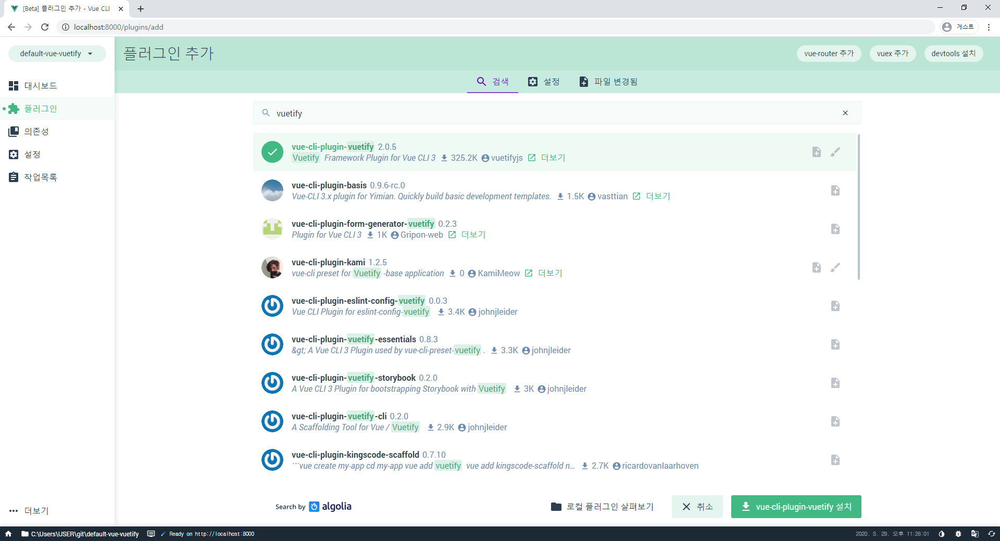
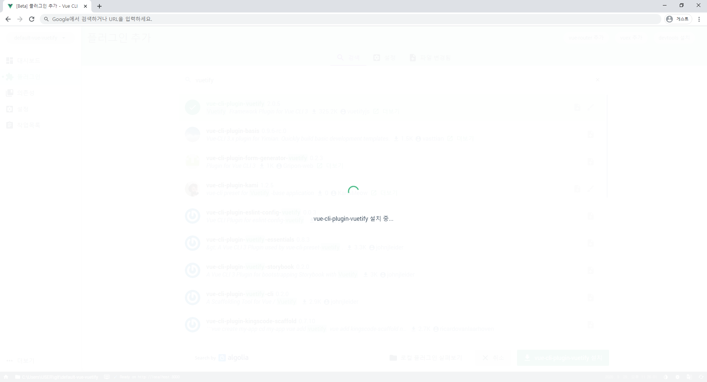
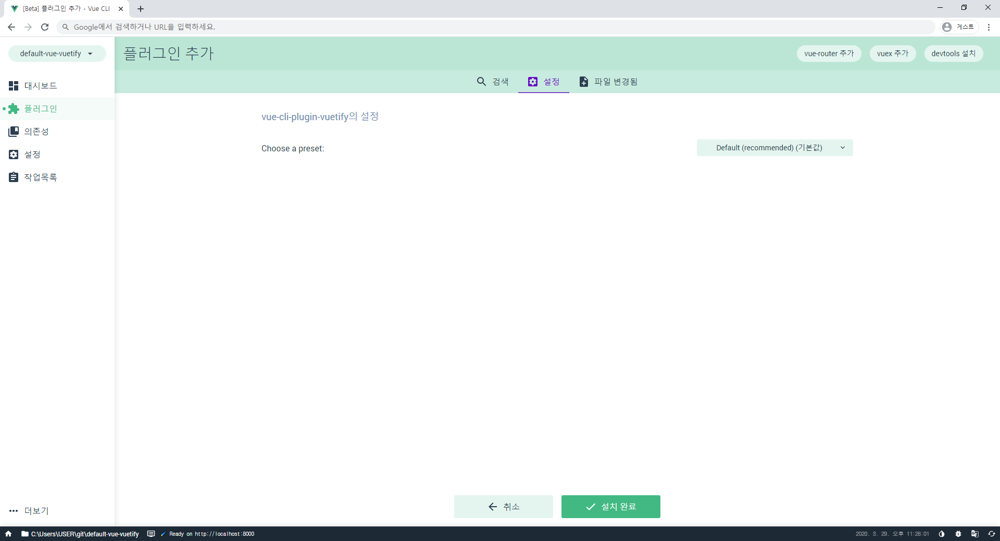
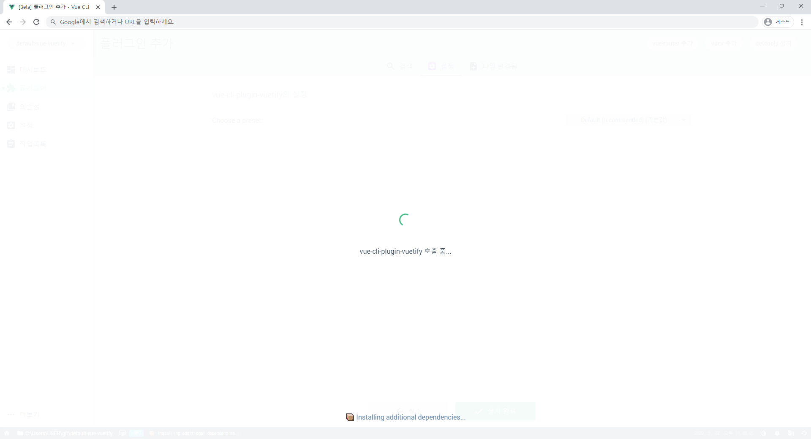
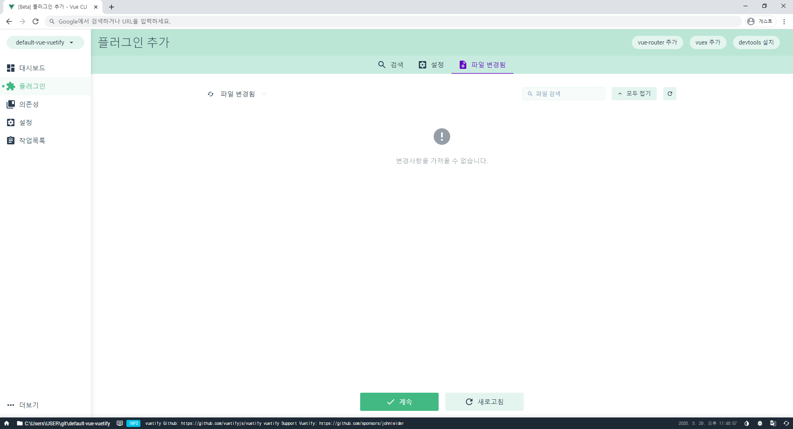
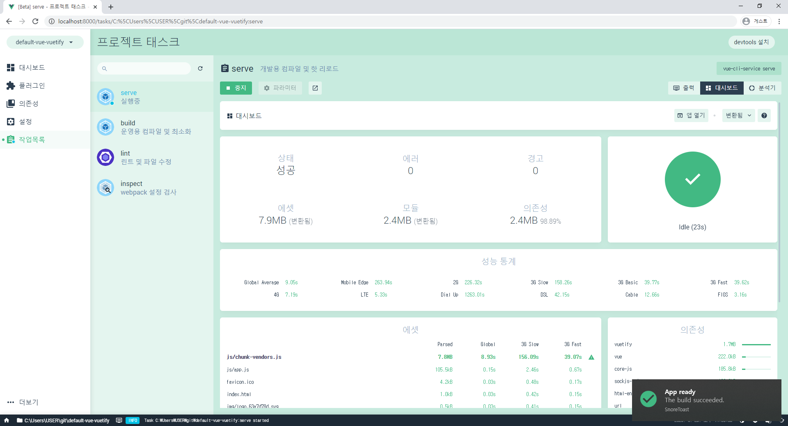
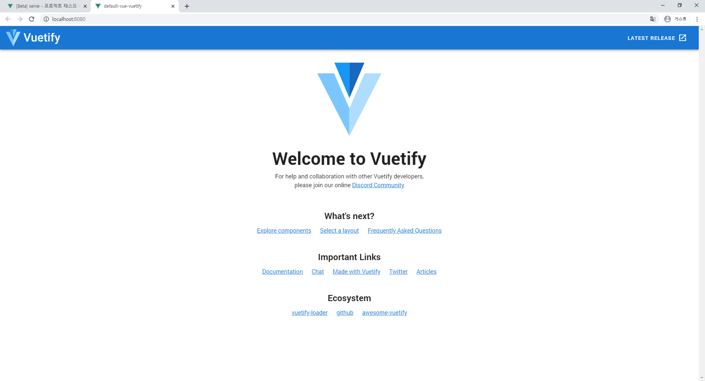

지난 포스팅에서 만들었던 기본 Vue 프로젝트에 Vuetify를 추가하는 과정입니다.

아무 것도 없는 빈 프로젝트에 추가하는 방법이며, 이미 작성중인 프로젝트에 추가하는 방법은 추후에 포스팅해보도록 하겠습니다.

Vue.js 공부를 하면서 프로젝트를 시작하는 과정을 기록합니다.

처음 공부하는 거라 틀린 부분이 있을 수 있습니다.

1. Vue CLI 실행

   ~~~shell
   $ vue ui
   🚀  Starting GUI...
   🌠  Ready on http://localhost:8000
   ~~~

   명령어를 입력하면 GUI 환경의  Vue 프로젝트 대시보드가 바로 실행됩니다.

   바로 실행되지 않으면 왼쪽 아래의 [더보기] - [Vue 프로젝트 매니저] (http://localhost:8000/project/select)에서  프로젝트를 선택할 수 있습니다.

   

2. 플러그인 설치

   

   - 왼쪽의 [플러그인] 메뉴 클릭 - 프로젝트 플러그인 화면으로 이동

   - 오른쪽 상단의 [+ 플러그인 추가] 버튼 클릭
     - 필요시 상단의 [vue-router 추가] / [vuex 추가]를 클릭해서 설치할 수 있습니다.

   

   

   - 검색창에 [Vuetify] 입력

   - 가장 위에 나오는 vue-cli-plugin-vuetify 선택

   - 오른쪽 아래에 있는 [ vue-cli-plugin-vuetify 설치] 버튼 클릭

     

   

   잠시 기다리면 설정 페이지가 나타납니다.

   

   기본값 그대로 설정하고 [설치 완료] 버튼을 클릭합니다.

   

   

   또 잠시 대기

   

   

   [계속] 버튼 클릭

   

   

   설치된 플러그인 목록 가장 아래에 Vuetify가 추가된 것을 확인할 수 있습니다.

   

   

   [작업목록] - [serve] - [시작] - [앱 열기]

   

   

   Vuetify index가 실행된 모습을 볼 수 있습니다.

   

3. 폴더 구조 확인

   ~~~
   📦default-vue-vuetify // 프로젝트 root 폴더
    ┣ 📂node_modules
    ┣ 📂public
    ┣ 📂src
    ┃ ┣ 📂assets
    ┃ ┣ 📂components
    ┃ ┃ ┗ 📜HelloWorld.vue // Vuetify의 메인페이지로 수정됨
    ┃ ┣ 📂plugins
    ┃ ┃ ┗ 📜vuetify.js // Vuetify 플러그인 추가됨
    ┃ ┣ 📜App.vue // Vuetify의 메인페이지로 수정됨
    ┃ ┗ 📜main.js // Vuetify import됨
    ┣ 📜.gitignore
    ┣ 📜babel.config.js
    ┣ 📜package-lock.json
    ┣ 📜package.json
    ┣ 📜README.md
    ┗ 📜vue.config.js // Vuetify config 파일 추가됨
   ~~~

   지난 포스팅에서 봤던 폴더 구조에서 파일 몇 가지가 수정되고 추가된 것을 확인할 수 있습니다.

   이제 컴포넌트들을 추가해서 Vuetify로 화면을 그려볼 수 있습니다.